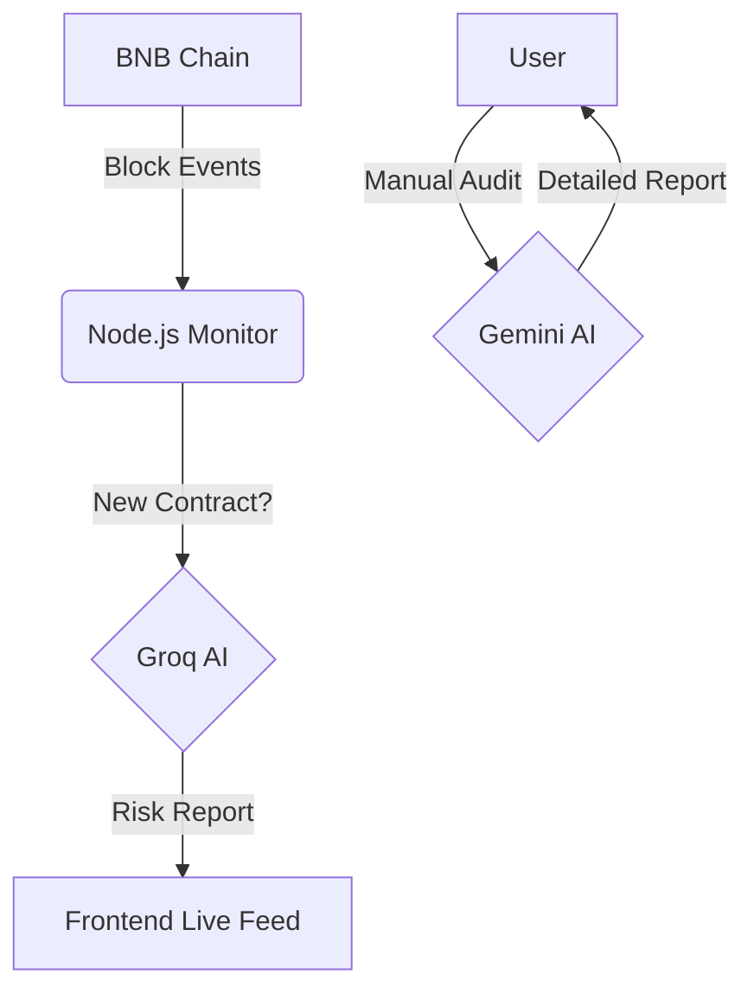

# 🛡️ Guardian Angel: Onchain AI Security Watchdog

<div align="center">
  
  <br/>
  
  
  
  
</div>

**Guardian Angel** is an autonomous security watchdog for the **BNB Chain hackathon**. Instead of just analyzing contracts on demand, it **proactively listens to the blockchain**, detects new contract deployments in real-time, and automatically subjects them to an AI security audit.

## 🚀 Core Features

### 1. 📡 Live Onchain Watchdog (New!)
*   **Real-Time Listener:** A backend service that subscribes to BNB Chain block events.
*   **Auto-Audit:** Automatically detects every new contract deployment and triggers an instant AI analysis of its bytecode and transaction input.
*   **Live Feed:** Displays a scrolling feed of new contracts and their immediate "Risk Vibe" score.

### 2. 📜 Smart Contract Auditor
*   **Deep Analysis:** Paste source code to get a line-by-line vulnerability report (Reentrancy, Access Control, Logic Bombs).
*   **Powered by Gemini:** Uses Google's Gemini Pro for deep reasoning and complex logic verification.

### 3. 🔍 Address Inspector & Visualizer
*   **Account Vetting:** Input any wallet address to get a summary of its activity, risk profile, and visualized history.
*   **Scam Detection:** Checks for patterns associated with known rug-pullers or honeypot creators.

### 4. 🕸️ Fund Traceback
*   **Forensic Analysis:** Reconstructs the flow of funds from a transaction hash.
*   **Visual Graphing:** Generates a text-based graph of asset movement to help trace stolen funds.

## 🏗 Architecture



## 🛠 Tech Stack

*   **Frontend:** React + Vite (Real-time dashboard)
*   **Backend:** Node.js + Express + Ethers.js (Blockchain Listener)
*   **AI:** Groq (Llama 3) for high-speed scanning, Gemini for deep audits
*   **Blockchain:** BNB Chain RPC

## 📦 Installation & Setup

### 1. Clone the Repository
```bash
git clone https://github.com/nighteye3/guardian-angel-onchain-ai.git
cd guardian-angel-onchain-ai
```

### 2. Backend (The Watchdog)
```bash
cd backend
npm install
# Create .env with GROQ_API_KEY and GEMINI_API_KEY
npm start
```
*The backend will immediately start printing live block data from BNB Chain.*

### 3. Frontend (The Dashboard)
```bash
cd frontend
npm install
npm run dev
```

## 🔐 Security
This tool is a passive observer and analyst. It does not hold custody of funds or require private keys to operate.

## 📜 License
MIT
