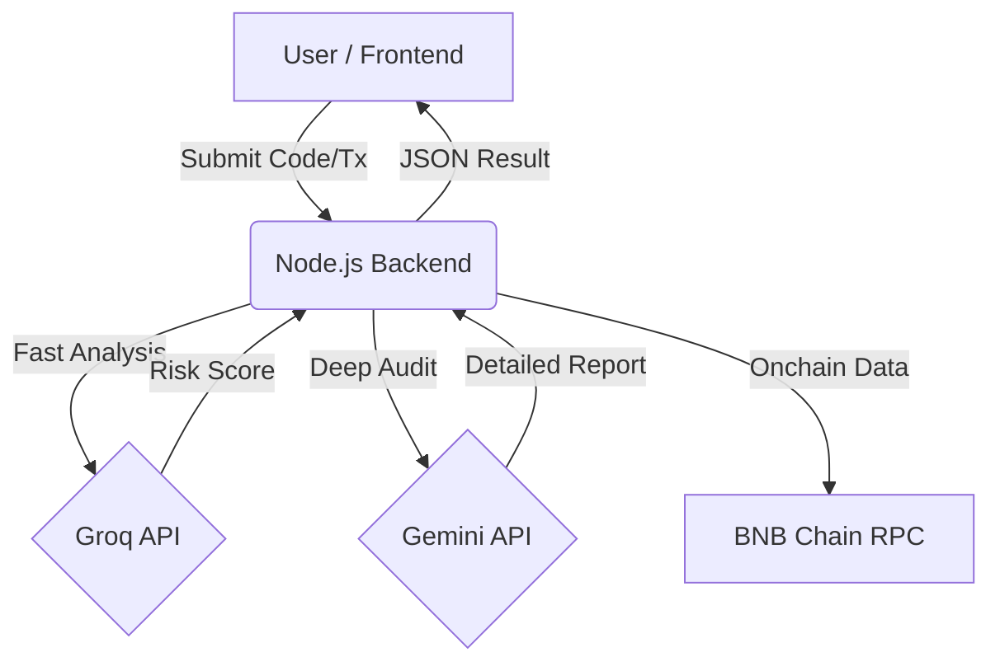

# 🛡️ Guardian Angel: AI-Powered Onchain Security Suite


**Guardian Angel** is a next-generation decentralized security platform built for the **BNB Chain "Good Vibes Only" Hackathon**. It combines high-speed inference (Groq) and deep reasoning (Gemini) to audit smart contracts, detect sophisticated scams, and visualize complex fund flows in real-time.

## 🚀 Core Features

### 1. 🧠 AI Smart Contract Auditor
*   **Instant Vulnerability Detection:** Scans Solidity code for reentrancy, integer overflows, and unchecked external calls.
*   **Logic Analysis:** Uses LLMs to understand the *intent* of the code, not just syntax, catching "business logic" exploits that static analyzers miss.
*   **Report Generation:** Delivers a professional, line-by-line security assessment.

### 2. 🕵️ Onchain Scam Detector
*   **Rug Pull Detection:** Analyzes liquidity pool configurations and ownership privileges to predict potential rugs.
*   **HoneyPot Scanner:** Simulates sell transactions to ensure tokens aren't locked.
*   **Pattern Recognition:** Identifies recurring scam signatures across the blockchain.

### 3. 🕸️ Fund Traceback Visualizer
*   **Visual Asset Tracking:** Graph-based visualization of fund movements to trace stolen assets through mixers or multiple hops.
*   **Money Flow Analysis:** AI-driven tagging of suspicious wallets and contract interactions.
*   **Incident Response:** Helps victims and investigators reconstruct the timeline of an attack.

## 🏗 Architecture



## 🛠 Tech Stack

*   **Frontend:** React + Vite (High-performance Dashboard)
*   **Backend:** Node.js + Express (AI Orchestration Layer)
*   **AI:** Groq (Llama 3) for speed, Google Gemini for reasoning
*   **Blockchain:** Solidity, Hardhat, Ethers.js
*   **Visualization:** React Flow (for transaction tracing)

## 📦 Installation & Setup

### Prerequisites
*   Node.js v18+
*   Git

### 1. Clone the Repository
```bash
git clone https://github.com/nighteye3/guardian-angel-onchain-ai.git
cd guardian-angel-onchain-ai
```

### 2. Backend Setup
```bash
cd backend
npm install
# Create .env file with GROQ_API_KEY and GEMINI_API_KEY
npm start
```

### 3. Frontend Setup
```bash
cd frontend
npm install
npm run dev
```

## 🔐 Security & Privacy
This tool is designed to **protect** users. No private keys are ever stored or transmitted to the backend. All analysis is performed on public data.

## 📜 License
MIT
